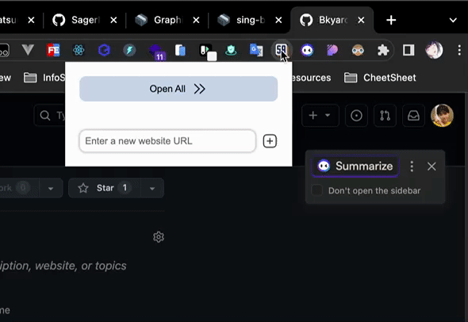

## site-all
self-use chrome extension to save urls in tools and one click to open all urls in new tab.

## main feature
- add url to "open all" list
- remove url from "open all" list
- open specific url instead of all urls
- open all url with simply one click
- 🖐🐟, initiate! 😜

## usage
clone this project and import to chrome plugin.